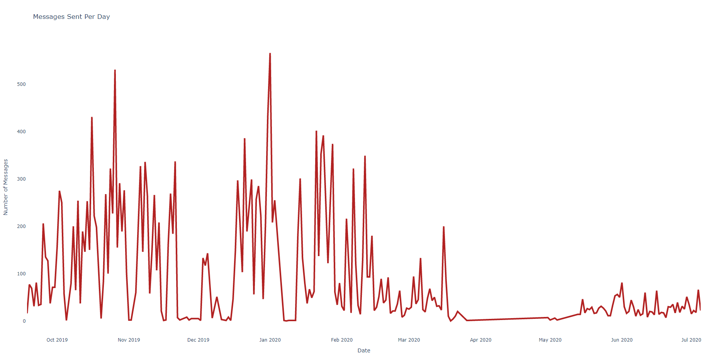
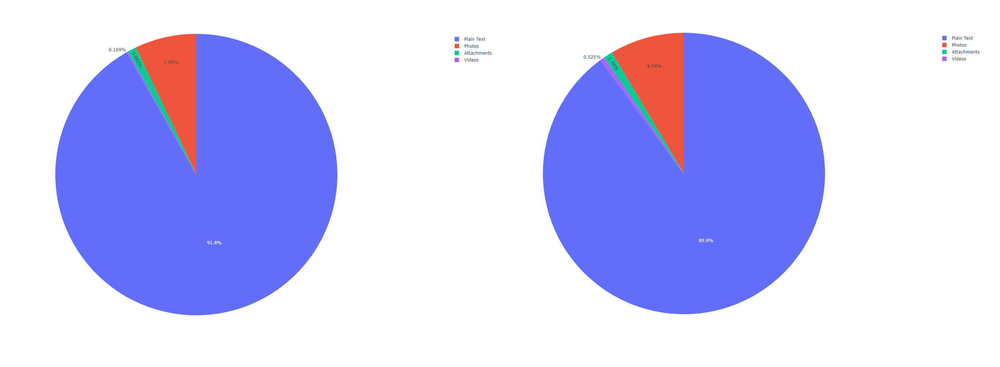

# Facebook Analytics 1.0 Alpha

Tired of Facebook stealing your data and selling it to China? Well now you can steal theirs(technically your own) and analyze them(for no profit btw). Want to see who is the better texter in a relationship? Or do you want to see who's the most annoying one? Find out now :).


## Table of contents
* [PLEASE READ](#please-read)
* [General info](#general-info)
* [Setup](#setup)

## PLEASE READ
Please download your json file off facebook, it may take up to 12-24hours for Facebook to get back to you.
1. Navigate to your Facebook Profile Page.
2. Navigate to Settings & Privacy > Settings > Your Facebook Information > Download Your Information
3. Select:
* Data Range: All my data
* Format: JSON
4. Select "Deselect All"
5. Select "Messages"
7. Select "Create File"
8. After 12-24hours, please download the zip file.

## General info
This project uses a data in the form of a .json file from Facebook and utilizes run_analytics.py script to export nesscary data as well as create charts. 
```
Number of Days Spanned: 
Number of Days Interacted:
Numbers of Messages Sent:
Number of Texts Sent:
Number of Photos Sent: 
Number of Days Video Called: 
Total Hours Video Called: 
Average Call Duration Per Day Called(hours):
```



## Setup
This project requires python3.3+ in order for pandas and plotly to work. Download the latest version of python for Mac/Windows/Linux
https://www.python.org/downloads/

To run this project, download the project as a zipfile:
1. Extract all files into a folder
2. Navigate to root directory of folder and run command in terminal to install requirements:
```
pip install -r requirements.txt
```
If pip command is not found then install pip using, then run the command above again:
```
python -m pip install
```
3. From the Facebook.zip file, locate the sender_name and drag that folder into project folder
4. Directory should look like this:
Project Folder:
> messages
  > John
    > message1.json
    > message2.json
    > message3.json
> .gitignore
> README.md
> facebook.py
> message-graph_data_example.png
> pie_chart_data_example.png
> requirements.txt
> run_analytics.py

5. From root directory run ```python3 run_analyitics.py``` or from Windows ```python run_analytics.py```
